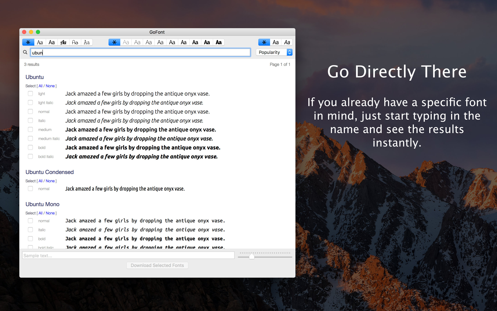

# GoFont

GoFont is a simple app that will make it easy to quickly search, preview, and download hundreds of free fonts from the Google Font catalog. Get access to all of the available fonts and browse through them using various filters to find the perfect typography to suit your needs.

## Features
* Filter fonts by category (Sans Serif, Serif, Monospace, etc.)
* Filter fonts by weight (Light, Normal, Bold, etc.)
* Filter fonts by style (Normal, Italic)
* Sort fonts alphabetically or by popularity, trendiness, or newness
* Page through large search results
* Enter in custom sample text
* Adjust the size of the sample text
* Select fonts to see them side by side
* Download all selected fonts to a folder of your choice

## Tips
* Want your fonts to be automatically installed? Just select the Home/Library/Fonts folder when choosing a download folder and your fonts will be automatically installed.

## Screenshots

